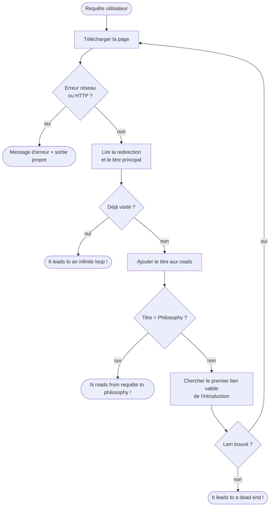
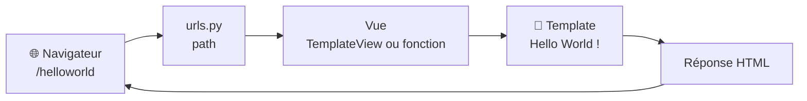

<div align="center">

# 🐍 Python-Django · Jour 1 — Librairies

**Six exercices pour apprendre à ne plus tout réécrire soi-même.**
Géohash, pip, API Wikipédia, scraping HTML, virtualenv… et un premier *Hello World* Django.


*« Aujourd'hui, nous allons manipuler quelques librairies pratiques en Python. »*

</div>

---

## 📚 Sommaire

- [🎯 Vue d'ensemble](#-vue-densemble)
- [🗂️ Structure du dépôt](#️-structure-du-dépôt)
- [⚡ Démarrage rapide](#-démarrage-rapide)
- [🧪 Les exercices](#-les-exercices)
  - [00 · Antigravity](#00--antigravity--geohashingpy)
  - [01 · Pip](#01--pip--my_scriptsh--my_programpy)
  - [02 · Requêter une API](#02--requêter-une-api--request_wikipediapy)
  - [03 · Parser du HTML](#03--parser-du-html--roads_to_philosophypy)
  - [04 · Virtualenv](#04--virtualenv--my_scriptsh)
  - [05 · Hello World](#05--hello-world--projet-django)
- [📏 Règles de la journée](#-règles-de-la-journée)
- [✅ Checklist avant le rendu](#-checklist-avant-le-rendu)
- [🧯 Problèmes fréquents](#-problèmes-fréquents)

---

## 🎯 Vue d'ensemble

| # | Exercice | Thème | Librairies autorisées | Difficulté |
|:-:|---|---|---|:-:|
| 00 | **Antigravity** | Calcul d'un géohash | `sys`, `antigravity` | 🟢 |
| 01 | **Pip** | Installer une lib depuis GitHub | `path.py` | 🟡 |
| 02 | **Requêter une API** | Recherche Wikipédia → fichier `.wiki` | `requests`, `json`, `dewiki`, `sys` | 🟡 |
| 03 | **Parser du HTML** | *Roads to Philosophy* | `sys`, `requests`, `BeautifulSoup` | 🔴 |
| 04 | **Virtualenv** | Environnement Django prêt à l'emploi | tout | 🟢 |
| 05 | **Hello World** | Première page Django | tout | 🟡 |

> 💡 **Fil rouge de la journée** : partir d'un simple script, apprendre à installer des dépendances proprement, consommer une API, scraper une page, puis finir sur un serveur web Django.

---

## 🗂️ Structure du dépôt

```text
.
├── ex00/
│   └── geohashing.py
├── ex01/
│   ├── my_script.sh
│   └── my_program.py
├── ex02/
│   ├── request_wikipedia.py
│   └── requirement.txt
├── ex03/
│   ├── roads_to_philosophy.py
│   └── requirement.txt
├── ex04/
│   ├── my_script.sh
│   └── requirement.txt
└── ex05/
    └── Django/            # projet Django (manage.py, settings.py, urls.py, templates/…)
```

---

## ⚡ Démarrage rapide

```bash
# 1. Cloner le dépôt
git clone <url-du-depot>
cd <nom-du-depot>

# 2. Préparer l'environnement Django (ex04) — à SOURCER, pas à exécuter
cd ex04
source my_script.sh
cd ..

# 3. Vérifier que le venv est actif
which python      # → .../django_venv/bin/python
pip list          # → Django, psycopg2, ...
```

> ⚠️ **`source` et pas `./`** : le sujet exige que le virtualenv soit **activé en quittant le script**. Seul `source my_script.sh` (ou `. my_script.sh`) exécute les commandes dans le shell courant. Avec `./my_script.sh`, l'activation disparaît avec le sous-shell.

---

## 🧪 Les exercices

### 00 · Antigravity — `geohashing.py`

> *Un petit échauffement inspiré de xkcd : atteindre un point aléatoire choisi par un algorithme.*

Calcule un **géohash** typique à partir des paramètres passés en ligne de commande, puis l'affiche sur la sortie standard.

- 📦 Autorisé : `sys`, `antigravity`
- 🚨 En cas d'erreur : message pertinent, sortie propre

```bash
python3 geohashing.py <paramètres du calcul du géohash>
```

---

### 01 · Pip — `my_script.sh` + `my_program.py`

> *Installer une librairie depuis son dépôt GitHub, dans un dossier précis, et l'utiliser.*

**Le script shell** doit :

| ✔ | Comportement |
|:-:|---|
| 1 | Avoir l'extension `.sh` |
| 2 | Afficher la version de `pip` utilisée |
| 3 | Installer la **version de développement** de `path.py` depuis GitHub dans `local_lib/` (dossier de rendu), en **écrasant** une installation existante |
| 4 | Écrire les logs d'installation dans un fichier `.log` |
| 5 | Lancer `my_program.py` **uniquement si** l'installation a réussi |

**Le programme Python** doit :

- importer `path.py` **depuis `local_lib/`** ;
- créer un dossier, y créer un fichier, y écrire du texte ;
- relire puis afficher le contenu ;
- respecter les [règles de la journée](#-règles-de-la-journée).

```bash
./my_script.sh
```

---

### 02 · Requêter une API — `request_wikipedia.py`

> *Wikipédia depuis le terminal, via l'API officielle.*

```bash
python3 request_wikipedia.py "chocolatine"
cat chocolatine.wiki
```

**Ce qui est attendu :**

- ✅ un résultat **même si la requête est mal orthographiée** (comme le site original) ;
- ✅ un texte **nettoyé** de tout JSON et wiki markup (via `dewiki`) ;
- ✅ un fichier nommé `nom_de_la_recherche.wiki`, **sans espace** ;
- ❌ **aucun fichier créé** en cas d'erreur (paramètre absent ou invalide, page introuvable, problème serveur…) et un message clair sur la console.

📄 Un `requirement.txt` doit être fourni pour l'installation des dépendances.

<details>
<summary>📖 Exemple de sortie attendue</summary>

```text
$> python3 request_wikipedia.py "chocolatine"
$> cat chocolatine.wiki
Une chocolatine designe :
* une viennoiserie au chocolat, aussi appelee pain au chocolat ou couque au chocolat ;
* une viennoiserie a la creme patissiere et au chocolat, aussi appelee suisse ;
* une sorte de bonbon au chocolat ;
* un ouvrage d'Anna Rozen
...
References
Categorie:Patisserie
Categorie:Chocolat
```

</details>

---

### 03 · Parser du HTML — `roads_to_philosophy.py`

> *La légende dit qu'en cliquant sans cesse sur le premier lien d'un article Wikipédia, on finit toujours sur « Philosophy ». Vérifions-le.*

```bash
python3 roads_to_philosophy.py "42 (number)"
```

**Contraintes :**

- 🌐 Requête sur l'URL du **Wikipédia anglais** comme dans un navigateur — **l'API est interdite**.
- 🍲 Parsing HTML avec **BeautifulSoup**.
- 🔁 Prise en compte de la **redirection interne** (pas la redirection d'URL).
- 🏷️ Le **titre principal** de chaque page est ajouté aux *roads*.
- 🔗 On prend le **premier lien valide** du paragraphe d'introduction. Ici, on n'ignore **ni l'italique ni les parenthèses** : on écarte seulement les liens qui ne mènent pas à un article (`Help:`, `File:`, ancres `#…`, liens externes…).

**Algorithme :**



**Les trois issues possibles :**

| Cas | Message affiché |
|---|---|
| 🎉 Le chemin atteint *Philosophy* | la liste des articles, puis `<nombre> roads from <requête> to philosophy !` |
| 🧱 Aucun lien valide | `It leads to a dead end !` |
| ♾️ Page déjà visitée | `It leads to an infinite loop !` |

<details>
<summary>📖 Exemple de sortie du sujet</summary>

```text
$> python3 roads_to_philosophy.py "42 (number)"
42 (number)
Natural number
Mathematics
Ancient Greek
Greek language
Modern Greek
Colloquialism
Word
Linguistics
Science
Knowledge
Awareness
Conscious
Consciousness
Quality (philosophy)
Philosophy
17 roads from 42 (number) to philosophy !

$> python3 roads_to_philosophy.py Accuvio
It's a dead end !
```

</details>

> 🔄 **Wikipédia évolue.** Les articles sont réécrits en permanence : le chemin obtenu aujourd'hui peut différer de celui du sujet, et l'exemple `Accuvio` n'est plus forcément une impasse. Ce n'est pas un bug.

📄 Un `requirement.txt` doit être fourni.

---

### 04 · Virtualenv — `my_script.sh`

> *Préparer le terrain pour la journée Django.*

**`requirement.txt`** : les dernières versions stables de `django` et `psycopg2`.

**`my_script.sh`** :

```bash
#!/bin/bash
python3 -m venv django_venv
source django_venv/bin/activate
pip install -r requirement.txt
```

**Utilisation :**

```bash
source my_script.sh     # ✅ le venv reste activé après le script
```

<details>
<summary>🔎 Comment vérifier que tout est bien dans le venv ?</summary>

```bash
which python            # doit passer par .../django_venv/bin/
pip list                # Django, psycopg2, sqlparse, asgiref…
pip show Django         # Location: .../django_venv/lib/python3.x/site-packages
deactivate              # pour quitter le venv
```

</details>

> 💡 `psycopg2` se compile à l'installation. En cas d'échec : `sudo apt install libpq-dev python3-dev`.

---

### 05 · Hello World — projet Django

> *Suivre et adapter le tutoriel officiel pour afficher un simple texte.*

**Objectif :** `http://localhost:8000/helloworld` affiche `Hello World !`.

```bash
source ex04/my_script.sh        # ou : source django_venv/bin/activate
python3 Django/manage.py runserver
```

Puis ouvrir 👉 <http://localhost:8000/helloworld>

**Le flux d'une requête Django :**



**Repères utiles :**

| Élément | Où ? | Rôle |
|---|---|---|
| Route | `urls.py` du projet | associe `helloworld` à une vue (sans `/` initial) |
| Template | `templates/` à côté de `manage.py` | contient le HTML |
| `DIRS` | `settings.py` → `TEMPLATES` | déclare le dossier `templates/` : `[BASE_DIR / 'templates']` |
| `DEBUG` / `ALLOWED_HOSTS` | `settings.py` | `DEBUG = True` en local, sinon renseigner `ALLOWED_HOSTS` |

📦 Le rendu est un **dossier contenant le projet Django complet**.

---

## 📏 Règles de la journée

> [!IMPORTANT]
> Ces règles s'appliquent à **tous** les exercices Python.

- 🚫 **Aucun code dans le scope global** : tout passe par des fonctions.
- 🏁 Chaque fichier se termine par un appel de fonction protégé :

  ```python
  if __name__ == '__main__':
      your_function(whatever, parameter, is, required)
  ```

- 🩹 Une gestion d'erreur est tolérée dans cette même condition.
- 📦 **Aucun import** hors de ceux listés dans « Fonctions autorisées » de chaque exercice.
- 🐍 Interpréteur : **`python3`**.
- 💥 Aucun crash inattendu : un programme qui plante = projet non fonctionnel = **0**.
- 🖥️ Projet réalisé dans une **machine virtuelle**, avec un **dossier partagé** avec l'hôte.
- 🔧 Rendu uniquement via **Git** : seul le contenu du dépôt est évalué.

---

## ✅ Checklist avant le rendu

- [ ] Les dossiers s'appellent exactement `ex00/`, `ex01/`, … `ex05/`
- [ ] Les fichiers ont les **noms exacts** du sujet (`requirement.txt`, sans « s »)
- [ ] Aucun code dans le scope global, `if __name__ == '__main__':` en fin de fichier
- [ ] Aucun import non autorisé
- [ ] Messages **mot pour mot** : `It leads to a dead end !` · `It leads to an infinite loop !`
- [ ] Format final : `<nombre> roads from <requête> to philosophy !`
- [ ] Aucun fichier créé par `request_wikipedia.py` en cas d'erreur
- [ ] `my_script.sh` (ex04) crée `django_venv` et laisse le venv activé quand on le **source**
- [ ] Le venv (`django_venv/`) et les `.log` ne sont **pas** versionnés (`.gitignore`)
- [ ] Le projet Django démarre et `/helloworld` affiche `Hello World !`

---

## 🧯 Problèmes fréquents

<details>
<summary><b>Le venv n'est pas activé après mon script</b></summary>

Tu l'as lancé avec `./my_script.sh`. Utilise `source my_script.sh`.

</details>

<details>
<summary><b><code>CommandError: You must set settings.ALLOWED_HOSTS if DEBUG is False</code></b></summary>

Mets `DEBUG = True` dans `settings.py`, ou renseigne `ALLOWED_HOSTS = ["127.0.0.1", "localhost"]`.

</details>

<details>
<summary><b>Django affiche un 404 sur mon URL</b></summary>

Une route `path()` ne commence **pas** par `/`. Écris `path("helloworld", ...)` et non `path("/helloworld", ...)`. Vérifie aussi le `/` final : `helloworld` et `helloworld/` sont deux URLs différentes.

</details>

<details>
<summary><b><code>TemplateDoesNotExist</code></b></summary>

- le dossier `templates/` est-il à côté de `manage.py` ?
- `DIRS` contient-il `BASE_DIR / 'templates'` ?
- le nom du template est-il **exact**, sans espace ni faute de casse ?

</details>

<details>
<summary><b><code>roads_to_philosophy</code> ne trouve aucun lien</b></summary>

- Le premier `<p>` de l'intro peut ne contenir aucun lien : c'est une vraie impasse (pages d'homonymie, par exemple).
- Sur les pages d'homonymie, les liens sont souvent dans des `<ul>`, pas dans des `<p>`.
- Ignore bien les ancres (`#…`), les liens `Help:`, `File:`, et les liens externes.

</details>

---

<div align="center">

Fait avec ☕, `pip install` et un peu de patience.

**Bon courage pour la suite : demain, c'est Django !** 🚀

</div>
