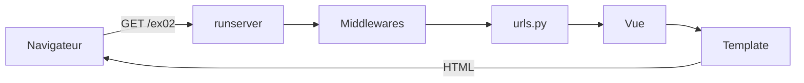
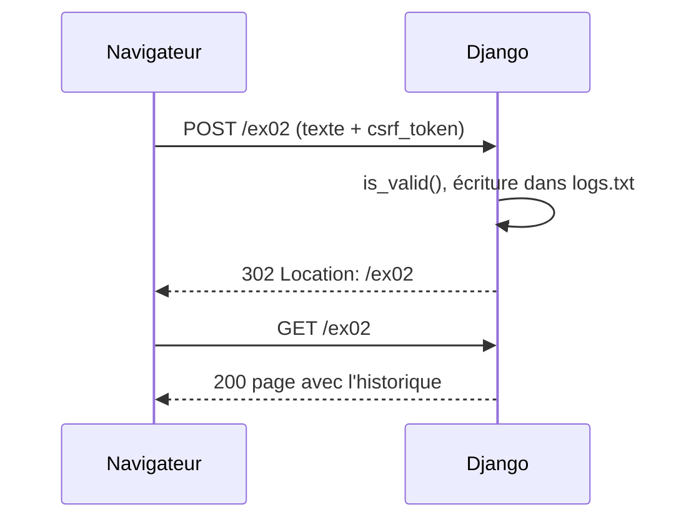

# Piscine Django · Jour 04 : Base Django

> Après le Python, Django ! Quatre exercices pour passer d'une première page statique à un formulaire persistant et à des templates dynamiques.


Les termes en lien renvoient à leur définition dans le [glossaire](#glossaire).

## Sommaire

- [Ce que j'ai appris](#ce-que-jai-appris)
- [Les exercices](#les-exercices)
  - [Ex00 : Markdown Cheatsheet](#ex00--markdown-cheatsheet)
  - [Ex01 : Quelques pages de plus](#ex01--quelques-pages-de-plus)
  - [Ex02 : Premier formulaire](#ex02--premier-formulaire)
  - [Ex03 : Fifty shades of bic](#ex03--fifty-shades-of-bic)
- [Le parcours d'une requête dans Django](#le-parcours-dune-requête-dans-django)
- [Aide-mémoire des commandes](#aide-mémoire-des-commandes)
- [Syntaxe des templates](#syntaxe-des-templates)
- [Erreurs rencontrées et solutions](#erreurs-rencontrées-et-solutions)
- [Lancer un exercice](#lancer-un-exercice)
- [Glossaire](#glossaire)

---

## Ce que j'ai appris

| Domaine | Notions |
|---|---|
| **Python** | [virtualenv](#virtualenv), imports relatifs (`from .views import ...`), héritage de classe, f-strings, formatage hexadécimal (`f"{v:02X}"`), lecture et écriture de fichiers (`open(..., "a")`) |
| **Django** | projet et apps, [URLconf](#urlconf), [vues](#vue), [templates](#template), [contexte](#contexte), [formulaires](#formulaire), [fichiers statiques](#fichiers-statiques), `settings.py`, [migrations](#migration), [ORM](#orm) |
| **Templates** | héritage (`extends` et `block`), `include`, boucles `for`, conditions `if`, [filtres](#filtre), ``, `` |
| **HTTP et sécurité** | GET et POST, codes 200, 302, 403 et 404, [redirection PRG](#redirection-prg), [CSRF](#csrf), `DEBUG` et `ALLOWED_HOSTS` |
| **HTML et CSS** | structure d'une page, sélecteurs de balise et de classe, flexbox, couleurs hexadécimales `#RRGGBB`, tableaux (`th`, `tr`, `td`) |
| **Outils** | WSL, IntelliJ (SDK, facettes, interpréteur WSL), SQLite, onglet Réseau des DevTools |

---

## Les exercices

| Ex | Sujet | URL | Notions clés |
|:--:|---|---|---|
| 00 | Première page statique | `/ex00` | venv, `requirements.txt`, projet, app, premier template |
| 01 | Plusieurs pages et DRY | `/ex01/django`, `/ex01/affichage`, `/ex01/templates` | `base.html`, `nav.html`, blocs, fichiers statiques, `collectstatic` |
| 02 | Premier formulaire | `/ex02` | `forms.Form`, POST, CSRF, fichier de logs, persistance |
| 03 | Dégradé de couleurs | `/ex03` | génération de données dans la vue, boucles dans le template |

Règles communes à tous les exercices :
- les routes d'une app sont dans son propre `urls.py` ;
- les formulaires sont dans le `forms.py` de l'app ;
- chaque URL fonctionne **avec et sans slash final** (`/ex00` et `/ex00/`), et toute autre URL renvoie une **404**.

### Ex00 : Markdown Cheatsheet

**Objectif :** créer l'environnement, le projet `d04` et l'app `ex00`, puis afficher une page qui rassemble toute la syntaxe Markdown.

```bash
python3 -m venv django_venv
source django_venv/bin/activate
pip install django
pip freeze > requirements.txt
django-admin startproject d04
cd d04 && python manage.py startapp ex00
```

**Ce que j'en retiens**
- Un **projet** contient la configuration (`settings.py`, `urls.py` racine). Une **app** est un module réutilisable, avec ses vues, ses templates et ses routes.
- Une app doit être déclarée dans `INSTALLED_APPS`, sinon Django ignore ses templates et ses fichiers statiques.
- `requirements.txt` permet de réinstaller exactement les mêmes dépendances avec `pip install -r requirements.txt`.

### Ex01 : Quelques pages de plus

**Objectif :** trois pages construites sur un même squelette, sans répéter de code (principe DRY).

```
templates/
├── base.html      ← squelette : blocs title, style, content
├── nav.html       ← barre de navigation, incluse dans base.html
├── django.html    ← 
├── affichage.html
└── templates.html
```

La consigne impose d'utiliser **chaque feuille de style une seule fois** : le choix se fait donc dans `base.html`, selon la route affichée.

```html

...

    <link rel="stylesheet" href="">

    <link rel="stylesheet" href="">

```

**Ce que j'en retiens**
- `` fait hériter une page d'un squelette, `` définit les zones à remplir, `` insère un fragment.
- `` doit être la **toute première ligne** d'une page enfant.
- `` ne se transmet pas par héritage : chaque template qui utilise `` doit le charger.
- Un chemin relatif comme `../css/style.css` ne marche pas : Django ne sert que les fichiers rangés dans un dossier `static/`.
- `collectstatic` rassemble tous les fichiers statiques dans `STATIC_ROOT`, pour la production.

### Ex02 : Premier formulaire

**Objectif :** un formulaire généré par `django.forms.Form`, et un historique horodaté qui survit au redémarrage du serveur.

```python
# settings.py
LOG_FILE = BASE_DIR / "ex02" / "logs.txt"
```

```python
# views.py
def index(request):
    if request.method == "POST":
        form = BasicForm(request.POST)
        if form.is_valid():
            date = timezone.localtime().strftime("%d/%m/%Y %H:%M:%S")
            with open(settings.LOG_FILE, "a", encoding="utf-8") as f:
                f.write(f"{date} : {form.cleaned_data['text']}\n")
            return redirect("ex02")
    else:
        form = BasicForm()
    ...
```

**Ce que j'en retiens**
- `BasicForm()` crée un formulaire vide, alors que `BasicForm(request.POST)` crée un formulaire [rempli](#formulaire-bound) à valider.
- On lit les données **après** `is_valid()`, dans `cleaned_data`.
- `` est obligatoire dans tout formulaire POST, sinon Django renvoie une 403.
- Le mode `"a"` d'`open()` ajoute à la fin du fichier et le crée s'il n'existe pas.
- Rediriger après un POST réussi évite le renvoi du formulaire quand on recharge la page.

### Ex03 : Fifty shades of bic

**Objectif :** un tableau de 4 colonnes (noir, rouge, bleu, vert) et 50 lignes de dégradé, avec des couleurs générées dans la vue et seulement 4 `<td>` dans le template.

```python
def index(request):
    rows = []
    for i in range(50):
        v = round(i * 230 / 49)
        rows.append({
            "noir":  f"#{v:02X}{v:02X}{v:02X}",
            "rouge": f"#{v:02X}0000",
            "bleu":  f"#0000{v:02X}",
            "vert":  f"#00{v:02X}00",
        })
    return render(request, "index.html", {"rows": rows})
```

**Ce que j'en retiens**
- Un code couleur se lit par paires : `#RRGGBB`, soit rouge, vert, bleu, chacune de `00` à `FF`.
- Le template ne contient **aucune donnée en dur** : la vue calcule, le template affiche.
- Une boucle `` produit les 50 lignes à partir d'un seul `<tr>` et de quatre `<td>`.
- Les clés de contexte sont des **chaînes** : `{"rows": rows}`, et non `{rows: rows}`.

---

## Le parcours d'une requête dans Django



1. Le **navigateur** envoie une [requête HTTP](#requête-http).
2. Les [middlewares](#middleware) la traitent : sessions, CSRF, authentification.
3. L'[URLconf](#urlconf) trouve la vue associée à l'URL.
4. La [vue](#vue) exécute la logique et prépare le [contexte](#contexte).
5. Le [template](#template) génère le HTML avec ces données.
6. Le navigateur affiche la page, puis envoie **une requête par fichier statique** (CSS, images...).

### Formulaire avec redirection (Post/Redirect/Get)



---

## Aide-mémoire des commandes

### Environnement virtuel

| Commande | Rôle |
|---|---|
| `python3 -m venv django_venv` | Crée un environnement virtuel |
| `source django_venv/bin/activate` | Active le venv |
| `deactivate` | Désactive le venv |
| `hash -r` | Vide le cache des chemins de bash, utile après un changement de venv |
| `pip install django` | Installe Django dans le venv actif |
| `pip freeze > requirements.txt` | Enregistre les dépendances installées |
| `pip install -r requirements.txt` | Réinstalle les dépendances d'un projet |
| `pip show django` | Vérifie que Django est installé, et où |

### Projet et apps

| Commande | Rôle |
|---|---|
| `django-admin startproject mysite` | Crée un projet (`manage.py`, `settings.py`, `urls.py`...) |
| `python manage.py startapp blog` | Crée une app dans le projet |
| `python manage.py runserver` | Lance le serveur de développement sur `127.0.0.1:8000` |
| `python manage.py runserver 8080` | Lance le serveur sur un autre port |
| `python manage.py runserver --insecure` | Sert les fichiers statiques même avec `DEBUG = False` |
| `python manage.py check` | Vérifie la configuration sans lancer le serveur |

### Base de données

| Commande | Rôle |
|---|---|
| `python manage.py makemigrations` | Écrit les fichiers de migration à partir des modèles |
| `python manage.py migrate` | Applique les migrations à la base |
| `python manage.py showmigrations` | Liste les migrations et leur état |
| `python manage.py flush` | **Vide la base** en gardant les tables |
| `python manage.py createsuperuser` | Crée un compte pour l'interface d'admin |
| `python manage.py shell` | Ouvre un shell Python avec le projet chargé |
| `python manage.py dbshell` | Ouvre un shell SQL sur la base |
| `rm db.sqlite3 && python manage.py migrate` | Repart d'une base neuve |

### Fichiers statiques et diagnostic

| Commande | Rôle |
|---|---|
| `python manage.py collectstatic` | Copie tous les fichiers statiques dans `STATIC_ROOT` |
| `python manage.py findstatic css/style1.css` | Indique où Django trouve un fichier statique |
| `python manage.py diffsettings` | Affiche les réglages différents des valeurs par défaut |

### SQLite

| Commande | Rôle |
|---|---|
| `sqlite3 db.sqlite3` | Ouvre la base |
| `.tables` | Liste les tables |
| `.schema ma_table` | Affiche la structure d'une table |
| `.headers on` puis `.mode column` | Affichage lisible |
| `SELECT * FROM ma_table;` | Affiche le contenu |
| `.quit` | Quitte |

---

## Syntaxe des templates

| Syntaxe | Rôle | Exemple |
|---|---|---|
| `{{ variable }}` | Affiche une valeur | `{{ titre }}` |
| `{{ objet.attribut }}` | Accède à une clé, un attribut ou un index | `{{ row.rouge }}`, `{{ liste.0 }}` |
| `{{ valeur\|filtre }}` | Transforme une valeur | `{{ m.date\|date:"d/m/Y H:i" }}` |
| `` | Hérite d'un template parent | `` |
| `` | Définit ou remplit une zone | `...` |
| `{{ block.super }}` | Reprend le contenu du bloc parent | dans un `` |
| `` | Insère un autre template | `` |
| `` | Boucle, avec `` si la liste est vide | `...` |
| `` | Condition | `...` |
| `` | Active la balise `static` | en haut du fichier |
| `` | URL d'un fichier statique | `` |
| `` | URL d'une route nommée | `` |
| `` | Jeton de sécurité des formulaires POST | dans chaque `<form method="post">` |

Dans une balise ``, les variables s'écrivent sans `{{ }}` : ``.

---

## Erreurs rencontrées et solutions

| Erreur | Cause | Solution |
|---|---|---|
| `` affiché en texte brut | `{ % include %}` avec une espace | Écrire `{%` sans espace |
| `Invalid block tag: 'static'` | `` manquant | L'ajouter en haut de chaque template concerné |
| CSS non appliqué, 404 sur le fichier | Chemin relatif ou fichier hors de `static/` | Ranger le CSS dans `app/static/` et utiliser `` |
| `ImproperlyConfigured: STATIC_ROOT` | `collectstatic` sans destination | Définir `STATIC_ROOT` dans `settings.py` |
| `You must set settings.ALLOWED_HOSTS` | `DEBUG = False` | Remettre `DEBUG = True`, ou remplir `ALLOWED_HOSTS` |
| `CSRF token missing` (403) | Formulaire POST sans jeton | Ajouter `` dans le `<form>` |
| `This field is required` dès l'affichage | Formulaire rempli avec `request.POST` pendant un GET | Créer `BasicForm(request.POST)` seulement en POST |
| `TemplateDoesNotExist` | `render(..., "templates/index.html")` | Chemin relatif au dossier `templates/` : `"index.html"` |
| `No module named 'views'` | Import absolu dans une app | `from .views import index` |
| `missing argument 'request'` | `path('', index())` | Passer la fonction sans parenthèses : `path('', index)` |
| `unhashable type: 'list'` | `{rows: rows}` | Clé en chaîne : `{"rows": rows}` |
| `Could not parse the remainder` | `{{ m.date:"d/m/Y" }}` | Utiliser le filtre : `{{ m.date\|date:"d/m/Y" }}` |
| `No module named 'django'` | Mauvais venv actif | `deactivate`, `hash -r`, puis activer le bon venv |

---

## Lancer un exercice

```bash
cd ex02
python3 -m venv django_venv
source django_venv/bin/activate
pip install -r requirements.txt
cd d04
python manage.py migrate
python manage.py runserver
```

Puis ouvrir `http://127.0.0.1:8000/ex02`. Pour l'ex01, lancer aussi `python manage.py collectstatic`.

---

## Glossaire

### Virtualenv
Environnement Python isolé, avec son propre interpréteur et ses propres paquets. Chaque exercice a le sien, décrit dans `requirements.txt`.

### Requête HTTP
Message envoyé par le navigateur : une méthode (GET pour lire, POST pour envoyer des données), une URL, des en-têtes et parfois un corps.

### Middleware
Code exécuté autour de chaque requête, dans l'ordre de la liste `MIDDLEWARE` de `settings.py` : sessions, CSRF, authentification...

### URLconf
Le routage : les fichiers `urls.py` associent chaque URL à une vue. Le `name=` d'une route permet de la retrouver avec `` ou `redirect()`.

### Vue
Fonction ou classe qui reçoit la `request` et renvoie une réponse. Elle correspond au *controller* d'autres frameworks, pas à la partie visuelle.

### Template
Fichier HTML contenant des balises Django. Il affiche les données fournies par la vue, sans logique métier.

### Contexte
Dictionnaire passé à `render()`. Chaque clé devient une variable du template : `render(request, "index.html", {"rows": rows})`.

### Filtre
Transformation appliquée à une variable avec `|` : `length`, `upper`, `date:"d/m/Y"`, `default:"vide"`...

### Formulaire
Classe héritant de `forms.Form`. Elle génère le HTML des champs, valide les données reçues et les convertit en types Python.

### Formulaire bound
Formulaire créé avec des données, comme `BasicForm(request.POST)`. Lui seul peut être validé avec `is_valid()`. À l'inverse, `BasicForm()` est vide (*unbound*).

### CSRF
*Cross-Site Request Forgery* : attaque où un autre site envoie une requête en utilisant les cookies du visiteur. Le jeton `` est comparé à un secret stocké en cookie, qu'un site extérieur ne peut pas lire.

### Redirection PRG
*Post/Redirect/Get* : après un POST réussi, la vue renvoie un **302** avec un en-tête `Location`. Le navigateur recharge alors la page en GET, ce qui évite de renvoyer le formulaire avec F5.

### Fichiers statiques
CSS, JavaScript et images. Django les cherche dans le `static/` de chaque app et dans `STATICFILES_DIRS`, puis les sert sous l'URL `STATIC_URL`. `collectstatic` les copie tous dans `STATIC_ROOT` pour la production.

### Migration
Fichier qui décrit une modification de la structure de la base. `makemigrations` l'écrit, `migrate` l'applique.

### ORM
Couche qui traduit les classes Python (modèles) en tables SQL : `Message.objects.create(...)` produit un `INSERT`.

[↑ Retour en haut](#piscine-django--jour-04--base-django)
